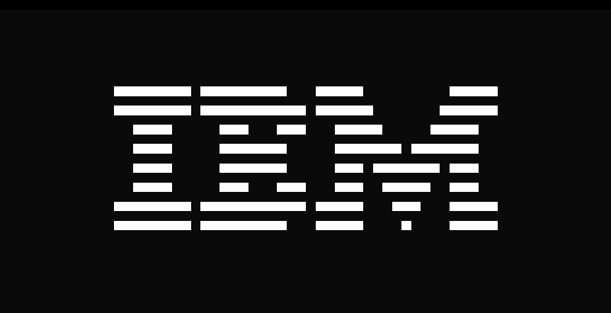
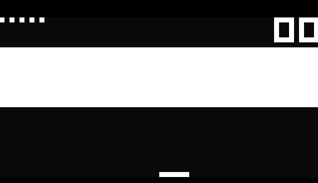
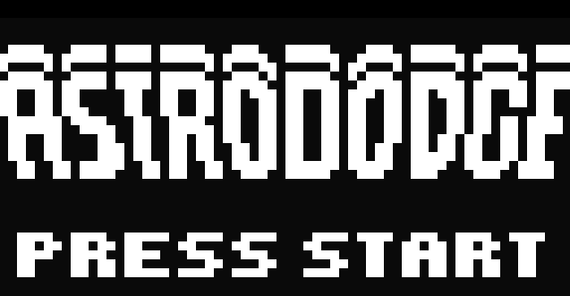

# Chip 8 Emulator

I wanted to familiarize myself with the C programming language and this seemed like a great and fun project :)

## Dependencies

- SDL2 (I should make this work with submodules or something)

## Compatibility

Should work on Linux, needs testing.